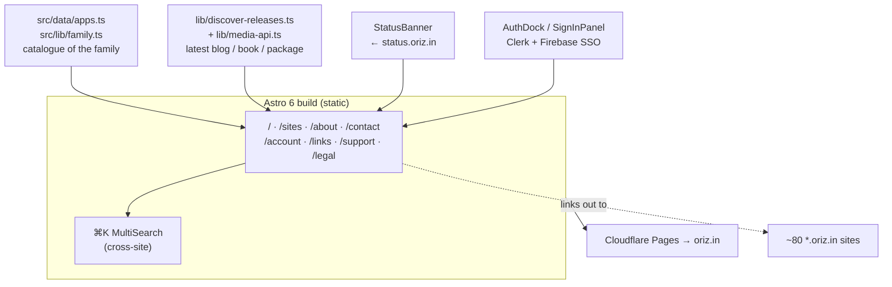

# oriz·home — the hub

> The apex landing site for the oriz family — one page that links every `*.oriz.in` site, tool, book, and package together.

[](./LICENSE)
[](https://github.com/chirag127/oriz-home/stargazers)
[](https://github.com/chirag127/oriz-home/commits)
[](https://astro.build)

**Live site:** https://oriz.in · **GHP landing:** https://chirag127.github.io/oriz-home/ · **Repo:** https://github.com/chirag127/oriz-home

⭐ If this is useful, please star the repo — it helps others find it.

The apex of the oriz family: the brand landing page, the catalogue of every site, and the shared sign-in entry point. Every other `*.oriz.in` domain points back here as the canonical hub.

## How it composes the family



## Features

- **`/` landing** — brand hub with animated hero (Motion) and live counters.
- **`/sites/` family catalogue** — every site in the family, driven by `src/data/apps.ts`.
- **Latest cards** — auto-surfaced newest blog post, book, and npm package via `discover-releases.ts` + RSS.
- **`⌘K` MultiSearch** — cross-site search from anywhere.
- **StatusBanner** — auto-pulls incident state from `status.oriz.in`.
- **Shared sign-in** — `/account/` with Google, GitHub, email-link, and anonymous (Clerk + Firebase); the SSO entry point for the whole family.
- **`/about`, `/contact`, `/links`, `/support`, `/legal/*`** — brand and legal pages.

## Tech stack

Astro 6 (static) · React 19 islands · Motion (`framer-motion`) · `lucide-react` · `@clerk/clerk-react` + `firebase` SSO · `rss-parser` for release feeds · Fontsource variable fonts · Tailwind CSS v4 · `@vite-pwa/astro` · Biome · Vitest + Playwright · `sharp` for icon generation · Wrangler (Cloudflare Pages).

## Repo structure

```
src/
  data/apps.ts             # the family catalogue
  lib/family.ts            # family metadata helpers
  lib/discover-releases.ts # newest blog/book/package
  lib/media-api.ts         # media/feed fetch
  components/              # AppCard, PackageCard, AuthDock, SEO, feature/*
  components/chrome/       # Sidebar, BottomBar, ConsentBanner
  pages/                   # /, sites, about, contact, account, links, legal
  layouts/ · styles/
scripts/gen-icons.mjs      # PWA icon generation
astro.config.mjs · biome.json · playwright.config.ts · vitest.config.ts
```

## Quick start

```bash
# On Windows build with npm (pnpm skips @esbuild/win32-x64 → Astro build crash)
npm install --legacy-peer-deps
npm run build              # astro build → dist/
npm run dev                # astro dev
npm test                   # vitest
npm run gen:icons          # regenerate PWA icons
```

Deploy (Cloudflare Pages): `astro build && wrangler pages deploy dist --project-name oriz-home --branch main --commit-dirty=true`.

## Configuration

Uses the family-wide env set (see [`.env.example`](./.env.example)). App-specific keys are limited to the shared account layer.

| Variable | Purpose |
| :--- | :--- |
| `PUBLIC_CLERK_PUBLISHABLE_KEY` | Clerk publishable key for shared `*.oriz.in` SSO (client-only). |
| `PUBLIC_FIREBASE_*` | Firebase client config for account features (client-only). |
| `PUBLIC_BASE_PATH` | Optional base path override for the Astro build. |

## Security note

No secrets in repo — `.env` is `sops`+`age`-encrypted (`.env.enc`). Every `PUBLIC_*` value is client-only; the Clerk secret key and any `PUBLIC_*_SECRET` are never present. Public content reads without auth; sign-in gates only account features.

## Part of the oriz family

The apex of the [oriz](https://blog.oriz.in) family by Chirag Singhal — ~80 sites and tools, all **$0 on the Cloudflare free tier**. Siblings it links to include [oriz-lore](https://github.com/chirag127/oriz-lore) (knowledge summaries) and [omnijournal](https://github.com/chirag127/omnijournal) (open-source PKM).

## Contributing

PRs welcome; open an issue first for large changes. Conventional commits are the changelog.

## Status

Stable / in production.

## License

MIT © Chirag Singhal — chirag@oriz.in · see [LICENSE](./LICENSE).
